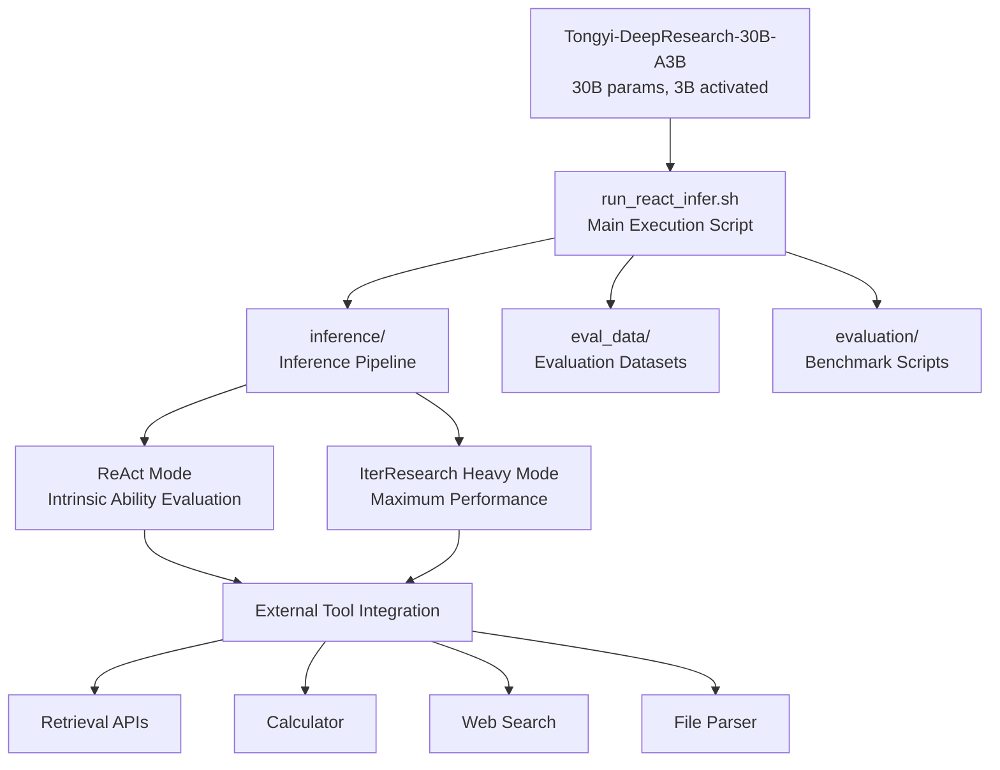
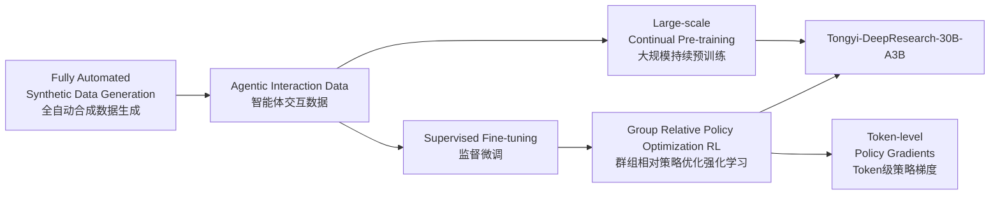
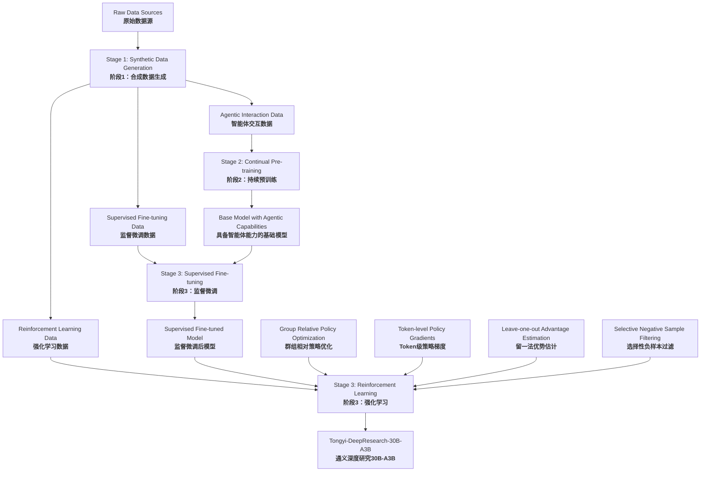
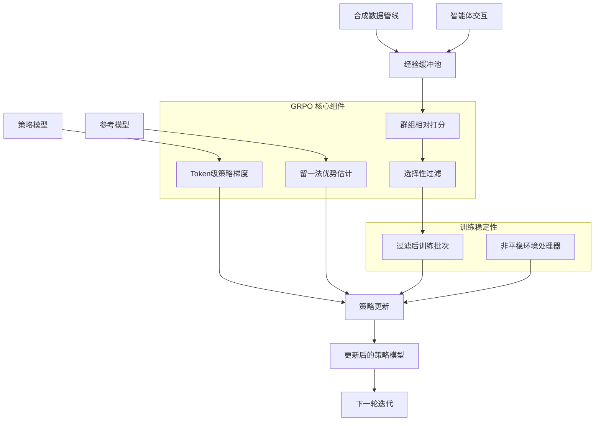
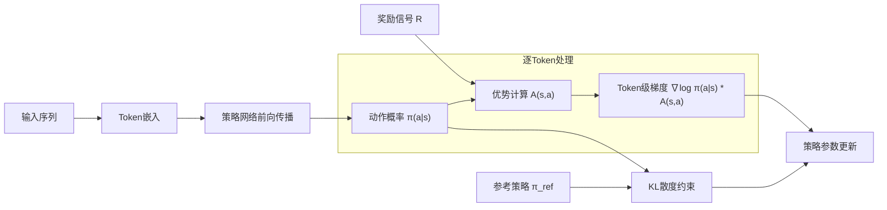
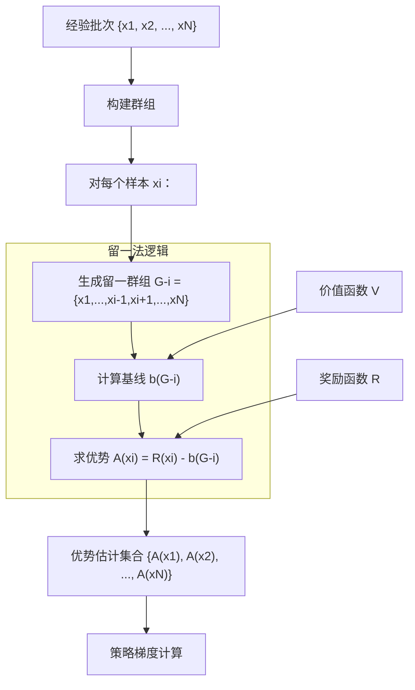
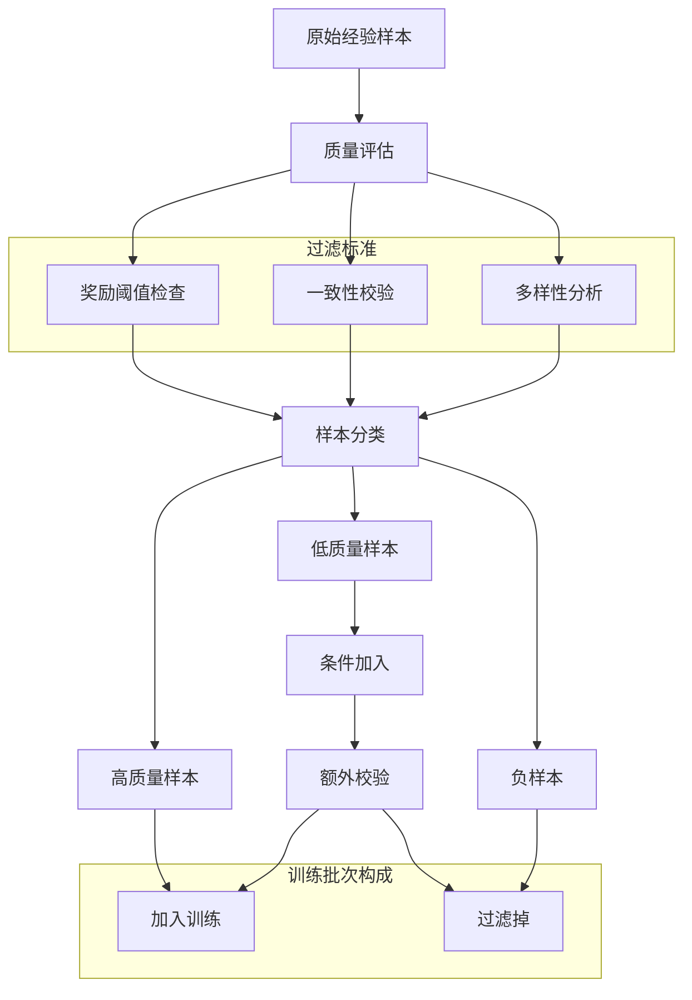
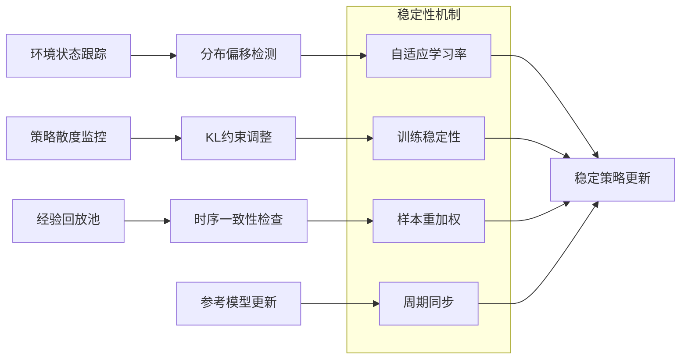
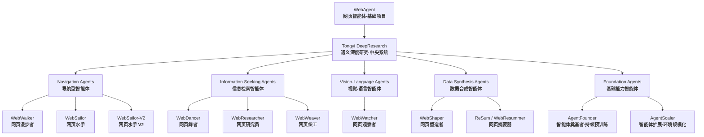

Tongyi DeepResearch 是一个大型语言模型，具有 300 亿个总参数，每个令牌只有 30 亿个参数的稀疏激活。该系统专为长期、深度信息搜索任务而设计，并在多个代理搜索基准测试中展示了最先进的性能，包括 Humanity's Last Exam、BrowserComp、WebWalkerQA、xbench-DeepSearch、FRAMES 和 SimpleQA。
该系统建立在 WebAgent 项目的基础上，并结合了一个完全自动化的合成数据生成管道，大规模的持续预训练，以及使用组相对策略优化的端到端强化学习。

## 核心系统架构
### 1. 高级组件结构

### 2. 训练和数据管道

#### 三阶段训练架构

**阶段1：自动合成数据生成**
该管道从一个完全自动化的合成数据生成系统开始，该系统为所有后续训练阶段创建不同的训练数据集。这一阶段产生：
- 预训练数据 ：用于持续预训练的大规模交互数据
- 有监督的微调数据 ：高质量的问答对和推理痕迹
- 强化学习数据 ：用于策略优化的事件数据
**第二阶段：持续的pre-training**
持续的预训练阶段使用多样化的高质量代理交互数据扩展基础模型的功能。这一过程：
- 保持数据的新鲜度和相关性
- 增强推理能力
- 扩展模型功能，用于长期任务(long-horizon tasks)
- 保留现有知识，同时增加代理能力
**第三阶段：微调和强化学习**
最后一个阶段将监督微调与端到端强化学习相结合：
- 监督微调 ：使模型与所需的响应模式和推理结构保持一致。
- 强化学习 ：采用具有专用组件的组相对策略优化框架，用于在非静态环境中进行稳定训练。
**强化学习框架详细信息**

| 组件 | 目的 | 执行 |
|---|---|---|
| 组相关策略优化 | 核心 RL 算法 | 定制的代理培训框架 |
| 令牌级策略约束 | 细粒度优化 | 每令牌梯度计算 |
| 留一法优势估计 | 方差减少 | 改进的优势估计 |
| 选择性阴性样本过滤 | 训练稳定性 | 在非平稳环境中过滤有问题的样本 |

Group Relative Policy Optimization Framework

1) 令牌级策略约束

令牌级方法确保以适当的粒度应用策略更新，使模型能够学习细微的代理行为，同时保持连贯的文本生成功能。

2) 留一法优势估计
> 留一法是一种交叉验证思想，每次只把一个样本“留”出来做验证或计算，其余全部样本用来训练或估计基线。

该框架采用了留一法的优势估计策略，为策略优化提供稳定和无偏的优势估计。这种技术有助于缓解通常与策略梯度方法相关的高方差。
优势评估流程:

这种估计方法通过使用每个批次中的剩余样本来建立动态基线来减少方差，从而导致更稳定的训练动态。

3) 选择性过滤机制
该框架采用了选择性过滤机制来处理负样本，并在非平稳环境中保持训练稳定性。此组件过滤掉可能会降低策略性能的潜在有害或低质量体验。
过滤管道

选择性过滤确保只有高质量的经验有助于政策更新，防止在复杂的代理环境中可能发生的负面样本的退化。

4) 非平稳环境镇定
GRPO 框架解决了在非平稳环境中训练的挑战，在非平稳环境中，最优策略可能会随着模型学习和环境动态的演变而发生变化。
稳定策略

GRPO 框架被实现为一个端到端系统，可以处理代理强化学习的复杂性，同时保持计算效率和训练稳定性。

| 组件 | 功能 | 关键特征 |
|---|---|---|
| 令牌级策略约束 | 细粒度优化 | 每代币奖励属性，梯度精度 |
| 留一法优势 | 方差减少 | 动态基线，无偏估计 |
| 选择性滤波 | 样品质量控制 | 阴性样品处理，一致性验证 |
| 环境稳定 | 非平稳性处理 | 自适应参数、分布监测 |

该框架的 on-policy 方法确保策略更新基于当前策略行为，避免了语言模型训练的 off-policy 方法中常见的分布不匹配问题。

---
## Agent Family 集成体系结构

