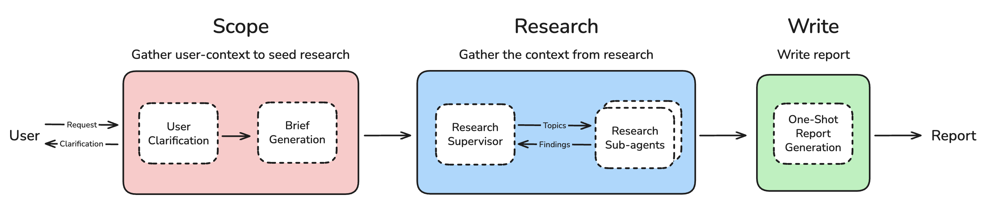
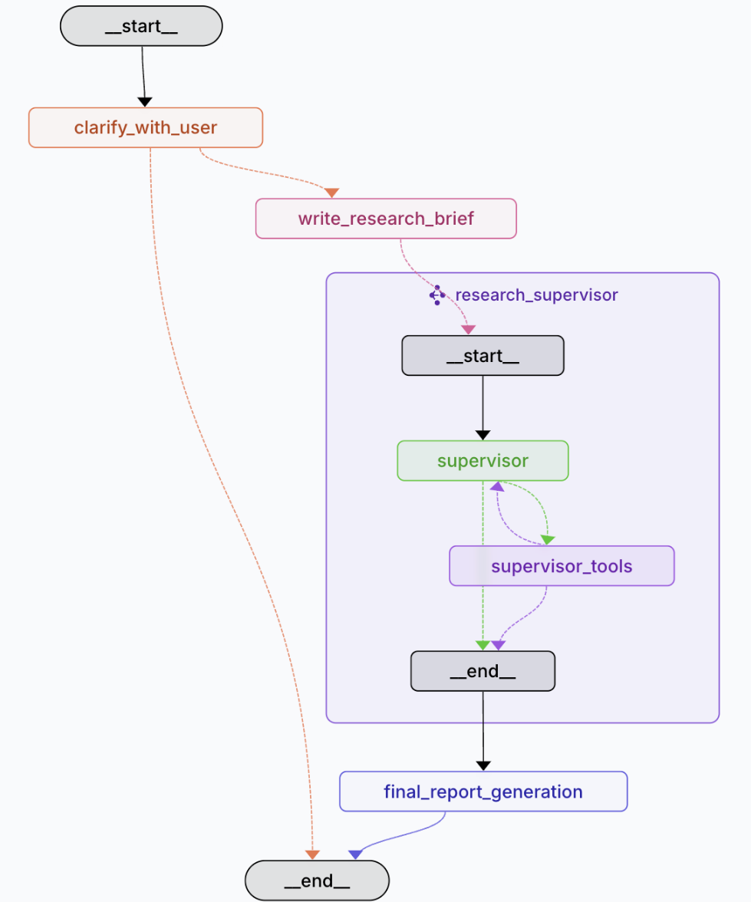

# 架构设计：三阶段工作流
**阶段一：规划scope**
1.用户澄清（Clarification）
用户需求澄清，通过聊天模型主动获取缺失的上下文和边界，例如目标受众、研究深度、偏好来源及时间范围等。
2.研究简报生成（Brief Generation）
澄清阶段的对话可能包含多轮交流、跟进问题以及用户提供的示例材料（如过往研究报告）。
为避免上下文膨胀与无效 token 消耗，系统会将这些信息凝练为一份结构化、可操作的研究简报。该简报在后续研究与撰写阶段充当“北极星”，持续对齐目标与范围。
> 相较于第一版本：传递多轮会话；该版本将冗长的对话压缩为聚焦的研究摘要

**第二阶段：研究**
输入：高质量聚焦的研究摘要
核心：multi-agent system，采用“主管-子智能体”的协同模型完成研究任务
输出：Findings

1.**研究主管 Supervisor**

对研究简报进行任务分解，并将子任务分派给若干子智能体。每个子智能体拥有独立的上下文窗口，专注于其对应的子主题。

**优势**：
- 支持**并行化**研究，显著缩短总体时长。
- **上下文隔离**。避免不同子主题之间的上下文干扰，提升信息质量与聚焦度

2.**研究子智能体 Sub-Agents**

- 每个子智能体仅围绕被分配的子主题开展工作
工具调用循环（Tool-Calling Loop）
- 搜索工具与/或 MCP 工具
- 子智能体在完成研究后，会进行一次收尾性 LLM 调用，产出围绕子问题的结构化回答，并附带必要的引用与出处。

**关键优化：子智能体输出前进行信息清洗，避免原始数据污染主管决策。**
> 为避免原始工具输出造成上下文与 token 膨胀，子智能体会对抓取的网页内容、失败的调用与无关信息进行清理与归纳后再返回给研究主管。这样可以降低上游解析负担，保证反馈的高密度与可用性。

3. **研究主管迭代（Research Supervisor Iteration）**
主管评估子结果的完整性，必要时发起深度补充研究

**第三阶段：报告撰写**
输入：Findings
过程：One-Shot Report Generation 一次性全部生成
输出：Report，可以参见`src/open_deep_research/prompts.py`
> 第一版过程：第二个阶段编写独立的章节，第三个阶段基于编写的章节，用大模型生成summary和conclusion，最后拼接成报告
【现在的报告是由第三个阶段完整地生成】

---
核心洞察：
1. 多智能体仅适用于可并行任务
> 教训：早期版本尝试并行撰写报告章节导致内容割裂，现改为仅研究阶段使用多智能体

2. 多智能体实现上下文隔离
> 优势：多智能体天然上下文隔离，避免上下文冲突，尤其适合子主题的研究
当请求包含多个子主题（如 A/B/C 对比）时，单智能体往往需要在单一上下文窗口中同时存储并推理所有子主题的工具反馈，且这些反馈往往包含大量 token。跨主题的工具调用逐步累积后，容易引发上下文冲突与推理偏移。通过为每个子主题分配独立的子代理及上下文窗口，可以显著降低干扰，提升答案的聚焦度与可验证性。

3. 动态调节研究深度
> 灵活性：主管根据启发式规则决定是否并行化，平衡速度与深度
参考Anthropic实践：https://www.oschina.net/news/355664/anthropic-built-multi-agent-research-system
通过主管系统，由主管自动决策需要什么样的深度，在一定深度下是否可以发起一定程度的并行执行，交给一个supervisor来管理，不仅可以节省token成本，另外相较于用工作流判断并行，更加有效和灵活。

4. 上下文工程对于缓解 Token 膨胀与引导行为至关重要

1）对话历史->研究摘要：减少token占用
> 研究任务天然消耗大量 Token。已有报告显示，多智能体系统的 Token 使用量可达普通聊天应用的 15 倍。
将多轮对话压缩为结构化研究简报，抑制历史消息导致的 Token 膨胀

2）子结论清洗：移除无关信息，辅助主管判断是否还需要调研

> 由子代理先行清洗与归纳研究结果，剔除无关信息与失败调用，再上送主管

3）实际收益：降低30%token消耗，避免速度限制

> 缺乏充分的上下文工程会使代理快速触达上下文窗口上限，且提升无效 Token 成本。
合理的上下文工程不仅能优化成本，还可降低 TPM 速率限制触发概率。

---

下一步计划：
- 优化海量工具响应的过滤机制
- 探索质量保障的实时评估方案
- 研究长期记忆存储与复用机制

---



# 核心配置选项
通用设置
- 最大结构化输出重试次数 (默认: 3) - 解析失败时的重试次数
- 允许澄清问题 (默认: true) - 研究开始前是否可询问澄清问题
- 最大并发研究单元 (默认: 5) - 子智能体并行处理的最大数量

研究配置
- 搜索 API (默认: Tavily) - 支持 Tavily、OpenAI 原生网络搜索、Anthropic 原生网络搜索
- 最大研究迭代次数 (默认: 3) - 研究主管反思和追问的次数
- 最大 React 工具调用 (默认: 5) - 单个研究步骤中工具调用的最大迭代次数

模型配置
- 摘要模型 (默认: openai:gpt-4.1-nano) - 搜索结果摘要
- 研究模型 (默认: openai:gpt-4.1) - 研究分析
- 压缩模型 (默认: openai:gpt-4.1-mini ) - 子智能体结果压缩
- 最终报告模型 (默认: openai:gpt-4.1 ) - 最终报告撰写

摘要和压缩都可以使用小一点的模型，但是研究分析最好用claude

💡模型要求: 所有模型必须支持结构化输出和工具调用功能。

MCP 服务器集成
本地 MCP 服务器
文件系统 MCP 服务器 - 提供安全的文件系统操作：
`mcp-server-filesystem /path/to/allowed/dir1 /path/to/allowed/dir2`

远程 MCP 服务器
支持分布式智能体协调和流式 HTTP 请求。示例配置：
```
{
  "url": "https://api.arcade.dev/v1/mcps/ms_0ujssxh0cECutqzMGBTxSGnjorm",
  "tools": ["Search_SearchHotels", "Search_SearchOneWayFlights", "Search_SearchRoundtrip
}
```

# LangChain Open Deep Research 系统质量评估总结(单例)
>参考：https://www.apframework.com/blog/essay/2025-08-14-open-deep-research

该系统的质量评估核心聚焦于**AI幻觉现象**，即生成内容中引用信息的准确性问题。通过实际案例分析引用与描述的匹配度，明确现有缺陷，并针对性提出优化方向，具体内容如下：

## 一、评估核心：AI幻觉现象（引用准确性）
评估以“研究报告中引用来源与内容描述的关联性”为核心指标，选取系统生成的“Spring AI 调研报告”中的引用案例，验证信息真实性与可靠性，共分析3个典型案例，涵盖“准确引用”与“引用偏差”两类情况。

## 二、典型案例分析
| 案例类型 | 案例描述 | 引用来源 | 评估结果 |
|----------|----------|----------|----------|
| 准确引用 | **Spring AI Samples**（Thomas Vitale）：官方示例项目，展示文档检索、ChatBot、向量数据库等功能一站式集成（涵盖多应用模板） | [2] spring-ai-community/awesome-spring-ai - GitHub | ✅ 文档内容与引用高度相关，无幻觉 |
| 引用偏差 | **Moroccan Cooking Companion**（美食生成AI助手）：结合向量数据库与OpenAI，构建带本地文档检索和多语言回复的个性化烹饪助手 | [5] 10 Real-Time Generative AI Projects Using Spring Boot, React ... - Medium | ❌ 引用源仅讨论“通用Spring Boot生成式AI项目”，与“美食助手”无直接关联，存在引用幻觉 |
| 准确引用 | **大学创新与教学应用**（Notre Dame）：利用Spring AI和LLM内核搭建课程问答、自动课程归类、学生课程转移评估等功能，提升教务效率 | [6] Spring 2025 AI at the University of Notre Dame Update | ✅ 引用源与描述内容高度匹配，信息准确 |


## 三、系统优化建议
针对引用偏差导致的AI幻觉问题，从“事前验证-事中约束-事后核查”三个环节提出优化方案：
1. **增强引用验证机制**：在子代理生成研究结论前，增加“引用源内容与子主题描述的匹配度检查”步骤，通过关键词比对、内容相关性分析等方式，过滤无关引用。
2. **优化上下文约束**：通过更精准的提示工程（Prompt Engineering），明确要求子代理仅引用与研究子主题直接相关的来源，减少无关信息混入，从源头降低幻觉概率。
3. **新增后处理质检流程**：在最终报告生成后，加入自动化事实核查环节，调用工具二次验证引用源的真实性及关联性，对可疑引用标记并提示人工复核。