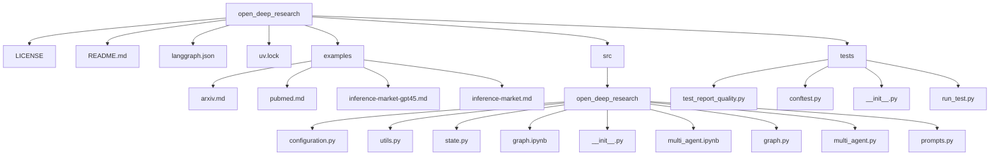
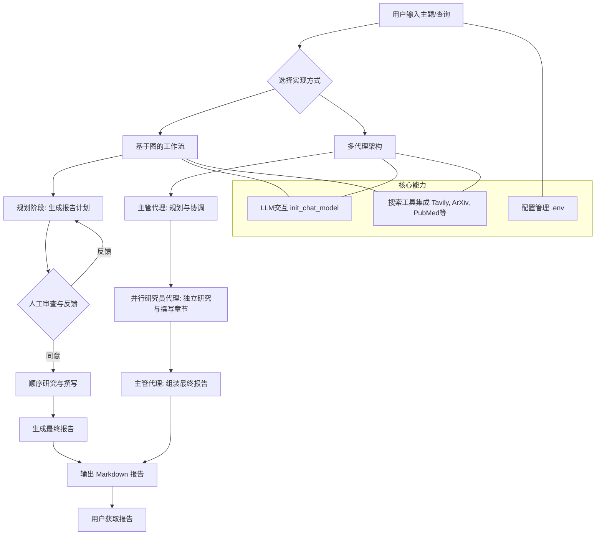

# 概述
## 项目结构


## 核心组件
Open Deep Research 的核心在于其两种实现方式：基于图的工作流和多代理架构。

1. **基于图的工作流实现** (src/open_deep_research/graph.py) ：
- 规划阶段：使用规划模型分析主题并生成结构化的报告计划。
- 人工干预：允许在进行下一步之前对报告计划进行人工反馈和批准。
- 顺序研究过程：逐个创建章节，并在搜索迭代之间进行反思。
- 章节特定研究：每个章节都有专门的搜索查询和内容检索。
- 支持多种搜索工具：兼容 Tavily、Perplexity、Exa、ArXiv、PubMed、Linkup 等所有搜索提供商。
- 可定制参数：report_structure、number_of_queries、max_search_depth、planner_provider、planner_model、writer_provider、writer_model、search_api 等。

2. **多代理实现** (src/open_deep_research/multi_agent.py) ：
- 主管代理：管理整个研究过程，规划章节并组装最终报告。
- 研究员代理：多个独立代理并行工作，每个代理负责研究和撰写特定章节。
- 并行处理：所有章节同时进行研究，显著缩短报告生成时间。
- 专业工具设计：每个代理都可以访问其角色的特定工具（研究员的搜索工具，主管的章节规划工具）。
- 目前仅限于 Tavily 搜索：当前多代理实现仅支持 Tavily 搜索，但未来框架将支持更多搜索工具。

## 架构概览
Open Deep Research 的整体架构围绕两种核心实现展开：基于图的工作流和多代理系统。两者都旨在自动化深度研究并生成综合报告，但它们在工作流程和并行性方面有所不同。

**基于图的工作流**： 该架构采用顺序的“计划-执行”模式。首先，一个规划器模型生成报告计划，然后用户可以对其进行审查和批准。一旦计划被接受，系统会逐个章节地进行研究和撰写，并在每次搜索迭代后进行反思。这种方法提供了对报告结构的精细控制，并允许在关键点进行人工干预。

**多代理架构**： 这种架构更注重效率和并行化。一个主管代理负责管理整个研究过程，而多个研究员代理则并行地研究和撰写不同的报告章节。每个代理都配备了其角色所需的特定工具。这种方法显著加快了报告生成速度，但目前主要依赖 Tavily 进行搜索。

两种架构都利用了 LangChain 的 `init_chat_model()` API 来与各种大型语言模型 (LLM) 进行交互，并支持多种搜索 API 来收集信息。配置通过 .env 文件进行管理，允许用户自定义模型选择、搜索工具和其他设置。



# 安装与问题指南
1. 环境准备与依赖安装
```bash
git clone https://github.com/langchain-ai/open_deep_research.git
cd open_deep_research

# 环境配置
cp .env.example .env

# 安装依赖
uv venv
uv pip install -r pyproject.toml
.venv\Scripts\activate
# LangGraph Studio 开发环境
uv pip install "langgraph-cli[inmem]"
uv pip install -e .
uv run --python 3.11 langgraph dev --allow-blocking

.venv\Scripts\activate


# 启动 LangGraph 服务器
langgraph dev
```

**可用搜索工具**：

- [Tavily API](https://tavily.com/) - 通用网络搜索
- [Perplexity API](https://www.perplexity.ai/hub/blog/introducing-the-sonar-pro-api) - 通用网络搜索
- [Exa API](https://exa.ai/) - 强大的神经网络搜索，用于网络内容
- [ArXiv](https://arxiv.org/) - 物理、数学、计算机科学等领域的学术论文
- [PubMed](https://pubmed.ncbi.nlm.nih.gov/) - 来自 MEDLINE、生命科学期刊和在线书籍的生物医学文献
- [Linkup API](https://www.linkup.so/) - 通用网络搜索
- [DuckDuckGo API](https://duckduckgo.com/) - 通用网络搜索
- [Google Search API/Scrapper](https://google.com/) - 创建自定义搜索引擎 [这里](https://programmablesearchengine.google.com/controlpanel/all) 并获取 API 密钥 [这里](https://developers.google.com/custom-search/v1/introduction)
- [Microsoft Azure AI Search](https://azure.microsoft.com/en-us/products/ai-services/ai-search) - 基于云的向量数据库解决方案

配置示例（以 Exa 为例） ： 某些搜索 API 支持额外的配置参数，例如 Exa。
```python
thread = {"configurable": {"thread_id": str(uuid.uuid4()),
                           "search_api": "exa",
                           "search_api_config": {
                               "num_results": 5,
                               "include_domains": ["nature.com", "sciencedirect.com"]
                           },
                           # Other configuration...
                           }}
```
2. 模型选择考量

参考链接：https://opendeep.wiki/langchain-ai/open_deep_research/getting-started#4-%E6%A8%A1%E5%9E%8B%E9%80%89%E6%8B%A9%E8%80%83%E9%87%8F

Open Deep Research 兼容多种大型语言模型（LLMs）。

- 你可以选择任何与 `init_chat_model()` API 集成的模型。
- 支持的集成列表可以在 [这里](https://python.langchain.com/api_reference/langchain/chat_models/langchain.chat_models.base.init_chat_model.html) 查看。

**重要提示**：

- **工作流规划器和写入器模型需要支持结构化输出**：请检查你使用的模型是否支持结构化输出。
- **代理模型需要支持工具调用**：确保工具调用得到良好支持。经过测试的模型包括 Claude 3.7、o3、o3-mini 和 gpt4.1。
- **Groq 的令牌限制**：如果你使用 Groq 的 `on_demand` 服务层级，可能会遇到每分钟令牌 (TPM) 限制。对于章节写作，建议使用付费计划。
- **`deepseek-R1` 的函数调用能力**：`deepseek-R1` 在函数调用方面可能不够强大，这可能会导致错误。建议使用在函数调用方面表现出色的提供商，如 OpenAI、Anthropic 和某些开源模型（如 Groq 的 `llama-3.3-70b-versatile`）。

依赖分析
参考：https://opendeep.wiki/langchain-ai/open_deep_research/getting-started#%E4%BE%9D%E8%B5%96%E5%88%86%E6%9E%90

性能考量
参考：https://opendeep.wiki/langchain-ai/open_deep_research/getting-started#%E6%80%A7%E8%83%BD%E8%80%83%E9%87%8F

在 Open Deep Research 中，性能主要受到以下几个方面的影响：

1. **模型选择**：
  
  - **LLM 的响应速度**：不同的大型语言模型（LLM）有不同的推理速度。选择响应速度快的模型可以显著提高报告生成效率。
  - **模型能力**：模型是否支持结构化输出和工具调用，会影响任务的成功率和效率。如果模型不支持，可能会导致任务失败或需要多次重试。
  - **TPM 限制**：某些模型提供商（如 Groq 的 `on_demand` 服务层级）有每分钟令牌（TPM）限制。当生成大量内容时，可能会遇到限速问题，导致任务延迟。对于需要大量生成内容的场景，建议使用付费计划或更高配额的服务。
2. **搜索 API 的效率**：
  
  - **搜索延迟**：不同的搜索 API 响应时间不同。选择响应速度快且可靠的搜索 API 可以减少数据获取的时间。
  - **搜索结果数量和质量**：`search_api_config` 中的 `num_results` 参数会影响搜索结果的数量，从而影响处理时间。获取高质量的搜索结果可以减少后续处理和反思的迭代次数。
3. **实现方式的选择**：
  
  - **多代理并行性**：多代理实现通过并行处理不同章节来显著缩短报告生成时间。这对于需要快速生成报告的场景非常有利。
  - **工作流顺序性**：基于图的工作流是顺序执行的，每个章节完成后才进行下一个。虽然这提供了更精细的控制和人工干预的机会，但可能会比多代理模式花费更多时间。
4. **配置参数**：
  
  - `number_of_queries`：每个章节生成的搜索查询数量。增加此值可能会提高报告质量，但会增加搜索和处理时间。
  - `max_search_depth`：最大反思和搜索迭代次数。更高的深度可以提高报告的深度和准确性，但会增加执行时间。

**优化建议**：

- **选择高效的 LLM**：根据任务需求和预算，选择在推理速度和功能支持方面表现良好的 LLM。
- **优化搜索配置**：根据实际需求调整 `num_results` 和 `max_search_depth` 等参数，在质量和速度之间找到平衡。
- **利用多代理模式**：如果对报告生成速度有较高要求，优先考虑使用多代理实现。
- **监控 API 使用情况**：密切关注 LLM 和搜索 API 的使用配额和速率限制，避免因超限导致的服务中断。

故障排除指南
参考：https://opendeep.wiki/langchain-ai/open_deep_research/getting-started#%E6%95%85%E9%9A%9C%E6%8E%92%E9%99%A4%E6%8C%87%E5%8D%97

在使用 Open Deep Research 过程中，你可能会遇到一些常见问题。本节提供了一些常见问题及其解决方案。

1. 模型错误：groq.APIError: Failed to call a function. Please adjust your prompt.

参考链接：https://opendeep.wiki/langchain-ai/open_deep_research/getting-started#1-%E6%A8%A1%E5%9E%8B%E9%94%99%E8%AF%AF-groq-apierror-failed-to-call-a-function-please-adjust-your-prompt

**问题描述**： 当你使用某些模型（例如 `deepseek-R1`）时，可能会遇到类似 `groq.APIError: Failed to call a function. Please adjust your prompt.` 的错误。这通常表示模型无法正确生成结构化输出或进行函数调用。

**原因分析**：

- **模型能力不足**：某些模型在函数调用或生成结构化输出方面表现不佳。Open Deep Research 的工作流规划器和写入器模型需要支持结构化输出，而代理模型需要支持工具调用。
- **提示词问题**：虽然错误信息提示调整提示词，但根本原因通常是模型本身的能力限制。

**解决方案**：

- **更换模型**：优先考虑使用在函数调用和结构化输出方面表现出色的模型，例如 OpenAI 的模型、Anthropic 的模型，以及某些开源模型如 Groq 的 `llama-3.3-70b-versatile`。
- **检查模型兼容性**：在选择模型之前，务必查阅 LangChain 的文档，确认模型是否支持结构化输出和工具调用。

2. 依赖安装问题

参考链接：https://opendeep.wiki/langchain-ai/open_deep_research/getting-started#2-%E4%BE%9D%E8%B5%96%E5%AE%89%E8%A3%85%E9%97%AE%E9%A2%98

**问题描述**： 在安装依赖时，可能会遇到 `uvx` 或 `pip install` 相关的错误，例如包找不到、权限问题或版本冲突。

**原因分析**：

- **`uv` 或 `pip` 未正确安装**：包管理器本身可能未正确安装或不在系统的 PATH 中。
- **网络问题**：无法从 PyPI 或其他源下载包。
- **权限问题**：在某些系统上，安装全局包可能需要管理员权限。
- **Python 版本不兼容**：项目可能要求特定的 Python 版本（例如 3.11），而你的环境中是其他版本。

**解决方案**：

- **确保 `uv` 或 `pip` 可用**：
  
  - 对于 `uv`，请再次运行 `curl -LsSf https://astral.sh/uv/install.sh | sh`。
  - 对于 `pip`，确保你的 Python 环境中已安装 `pip`。
- **检查网络连接**：确保你的设备可以访问 PyPI 和 Git 仓库。
  
- **使用虚拟环境**：强烈建议使用 Python 虚拟环境（如 `venv` 或 `conda`）来隔离项目依赖，避免与系统其他 Python 项目发生冲突。
  
  ```
  python3.11 -m venv venv_open_deep_research
  source venv_open_deep_research/bin/activate # Linux/macOS
  .\venv_open_deep_research\Scripts\activate # Windows
  ```
  
  然后再次运行安装命令。
  
- **检查 Python 版本**：确保你正在使用项目要求的 Python 版本。如果不是，请安装并切换到正确的版本。
  
- **管理员权限（仅在必要时）** ：如果遇到权限错误，尝试使用管理员权限运行终端（Windows）或使用 `sudo`（Linux/macOS），但这通常不推荐用于虚拟环境。
  
3. LangGraph Studio UI 无法访问

参考链接：https://opendeep.wiki/langchain-ai/open_deep_research/getting-started#3-langgraph-studio-ui-%E6%97%A0%E6%B3%95%E8%AE%BF%E9%97%AE

**问题描述**： 在启动 LangGraph 服务器后，浏览器无法打开 `http://127.0.0.1:2024` 或 `https://smith.langchain.com/studio/?baseUrl=http://127.0.0.1:2024`。

**原因分析**：

- **服务器未成功启动**：LangGraph 服务器可能因为某些错误未能成功启动。
- **端口被占用**：2024 端口可能被其他应用程序占用。
- **防火墙问题**：防火墙可能阻止了对该端口的访问。

**解决方案**：

- **检查终端输出**：查看启动命令的终端输出，是否有任何错误信息指示服务器启动失败。
- **检查端口占用**：
  - Linux/macOS: `lsof -i :2024`
  - Windows: `netstat -ano | findstr :2024` 如果端口被占用，尝试关闭占用该端口的应用程序，或者查看 LangGraph CLI 是否支持配置其他端口。
- **检查防火墙设置**：确保你的防火墙允许对 2024 端口的传入和传出连接。
- **重启服务器**：尝试终止当前进程（`Ctrl+C`）并重新运行启动命令。

4. 报告生成内容不符合预期

参考链接：https://opendeep.wiki/langchain-ai/open_deep_research/getting-started#4-%E6%8A%A5%E5%91%8A%E7%94%9F%E6%88%90%E5%86%85%E5%AE%B9%E4%B8%8D%E7%AC%A6%E5%90%88%E9%A2%84%E6%9C%9F

**问题描述**： 生成的报告内容质量不高，或者不符合预期。

**原因分析**：

- **LLM 模型质量**：所选 LLM 的能力不足以生成高质量的报告。
- **提示词质量**：`prompts.py`[8](https://opendeep.wiki/langchain-ai/open_deep_research/getting-started#user-content-fn-8) 中的提示词可能不够精确或没有充分引导模型。
- **搜索结果质量**：搜索工具获取的信息可能不准确、不完整或不相关。
- **配置参数不当**：`number_of_queries` 或 `max_search_depth` 等参数设置过低，导致信息获取不足。

**解决方案**：

- **升级 LLM 模型**：尝试使用更强大、更先进的 LLM 模型。
- **优化提示词**：仔细审查并修改 `prompts.py`[8](https://opendeep.wiki/langchain-ai/open_deep_research/getting-started#user-content-fn-8) 中的提示词，使其更清晰、更具体，并包含更多指导信息。
- **调整搜索配置**：
  - 增加 `number_of_queries` 以获取更多搜索结果。
  - 增加 `max_search_depth` 以允许更多的反思和搜索迭代。
  - 尝试不同的 `search_api`，选择在你的研究领域表现更好的搜索工具。
  - 利用 `search_api_config`（如 Exa 的 `include_domains`）来限制搜索范围，提高结果的准确性。
- **人工干预（工作流模式）** ：在工作流模式下，利用人工审查和反馈的机会，对报告计划进行调整，引导模型走向正确的方向。
